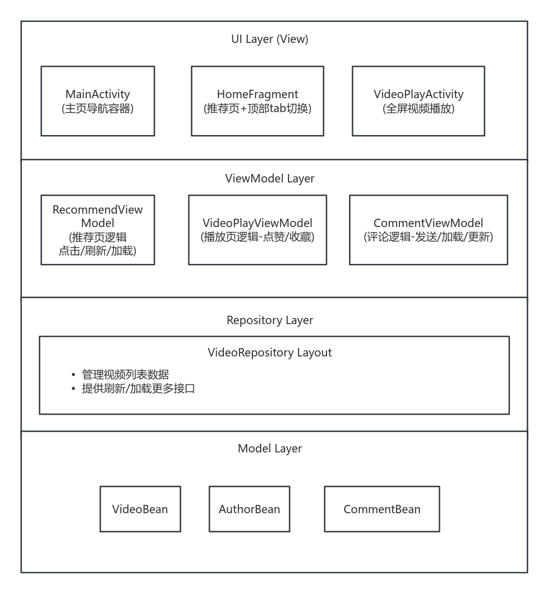
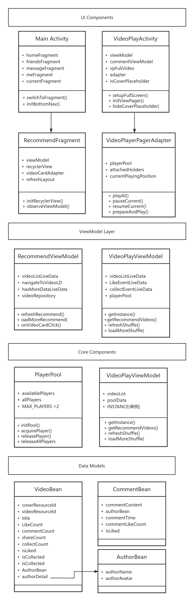
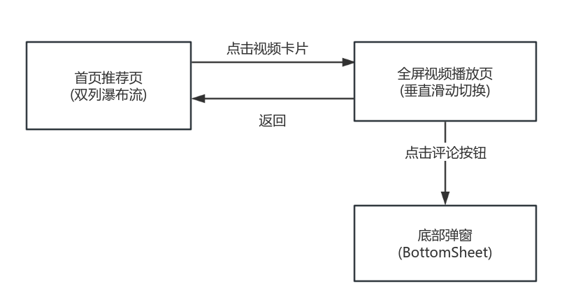
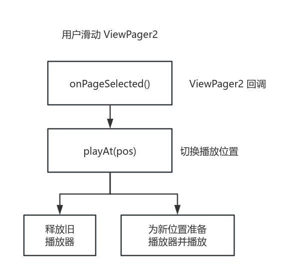
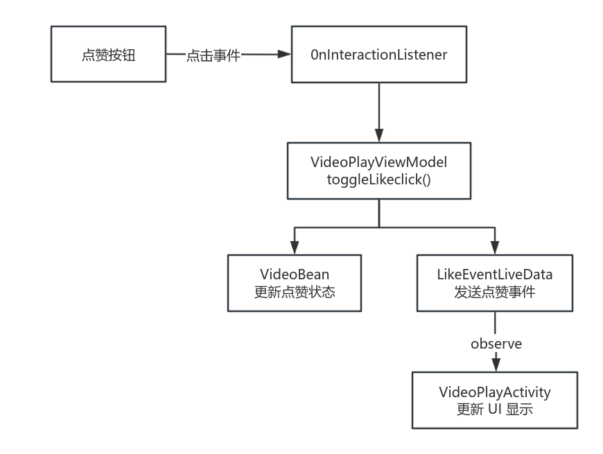
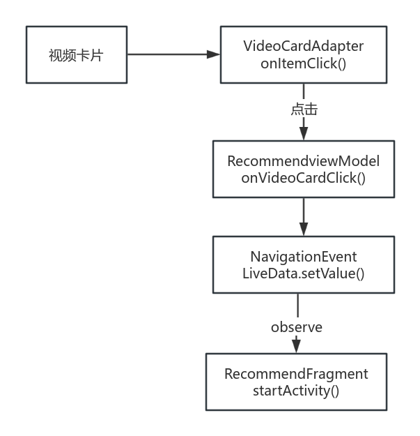

# 抖音短视频 Demo 设计文档

## 一、项目概述

### 1.1 项目背景
该项目是仿抖音风格的短视频浏览 Demo ,包含短视频各种核心交互体验，核心功能如下
- 双列视频流推荐（支持刷新与加载）
- 双列外流进入内流转场动画（<mark>AI辅助实现</mark>）
- 全屏沉浸式播放（支持单击暂停，双击点赞动画）
- 垂直滑动切换视频
- 点赞、收藏、评论等社交互动功能
- 视频流上拉加载，下拉刷新（无网络资源，本地视频资源随机重复加载模拟该效果）


### 1.2 设计目标
| 目标维度 | 具体目标 |
|---------|---------|
| **用户体验** | 较流畅的视频播放和滑动切换体验，无黑屏、无卡顿 |
| **性能优化** | 播放器资源管理，避免 MediaCodec 资源耗尽 <mark>（AI辅助实现：在ViewPager2+RecyclerView.Adapter作为视频内流方案的情况下，实现播放器资源管理，即跟据播放页面生命周期管理播放器资源）</mark> |
| **架构设计** | 采用 MVVM 架构，实现数据与 UI 解耦，便于维护和扩展 |
| **交互完整** | 支持点赞、收藏、评论、分享等核心社交互动功能 |

---

## 二、技术选型

### 2.1 整体技术栈

| 技术领域 | 选型 | 选型理由 |
|---------|------|---------|
| **开发语言** | Java | Android 原生开发，兼容性好 |
| **最低SDK** | API 24 (Android 7.0) | 覆盖 95%+ 设备 |
| **目标SDK** | API 36 | 适配最新系统特性 |
| **架构模式** | MVVM | 数据驱动 UI，关注点分离 |
| **视频播放** | Media3 ExoPlayer | Google 官方推荐，功能强大，支持多种格式 |
| **图片加载** | Glide 4.16.0 | 高效的图片加载与缓存 |
| **UI 组件** | Material Design | 遵循 Material 设计规范 |
| **列表组件** | RecyclerView.Adapter + ViewPager2 |(1) 自带预加载逻辑；(2) viewpager2+fragment需要反复加载和释放fragment；(3) recyclerview 需自写分页逻辑|
| **下拉刷新** | SmartRefreshLayout | 功能丰富的刷新组件 |

### 2.2 核心依赖库

```kotlin
// 视频播放
implementation(libs.media3.ui)
implementation(libs.media3.exoplayer)

// 架构组件
implementation("androidx.lifecycle:lifecycle-viewmodel:2.6.2")
implementation("androidx.lifecycle:lifecycle-livedata:2.6.2")
implementation("androidx.viewpager2:viewpager2:1.0.0")

// UI 组件
implementation("androidx.recyclerview:recyclerview:1.3.2")
implementation("com.google.android.material:material:1.9.0")
implementation("com.github.bumptech.glide:glide:4.16.0")

// 下拉刷新
implementation("io.github.scwang90:refresh-layout-kernel:2.1.0")
```

---

## 三、系统架构

### 3.1 整体架构图

### 3.2 类图



---

## 四、功能模块设计

### 4.1 模块划分

```
com.example.douyinline/
├── bean/                    # 数据模型层
│   ├── VideoBean.java       # 视频实体
│   ├── AuthorBean.java      # 作者实体
│   └── CommentBean.java     # 评论实体
├── repository/              # 数据仓库层
│   └── VideoRepository.java # 视频数据仓库（单例）
├── event/                   # 事件类
│   └── NavigationEvent.java # 页面导航事件
├── ui/                      # UI 层
│   ├── home/                # 首页模块
│   │   ├── HomeFragment.java
│   │   ├── HomeViewPagerAdapter.java
│   │   └── recommend/       # 推荐页子模块
│   │       ├── RecommendFragment.java
│   │       ├── RecommendViewModel.java
│   │       └── VideoCardAdapter.java
│   ├── video/               # 视频播放模块
│   │   ├── VideoPlayActivity.java
│   │   ├── VideoPlayViewModel.java
│   │   ├── VideoPlayerPagerAdapter.java
│   │   ├── PlayerPool.java
│   │   ├── CommentBottomSheetFragment.java
│   │   ├── CommentViewModel.java
│   │   └── CommentSheetAdapter.java
│   ├── friends/             # 朋友页模块
│   ├── message/             # 消息页模块
│   └── me/                  # 个人页模块
└── MainActivity.java        # 主入口
```

### 4.2 核心页面流程


---

## 五、核心功能实现思路

### 5.1 视频播放器池 (PlayerPool)

**设计目标**：复用 ExoPlayer 实例，避免频繁创建销毁，防止 MediaCodec 资源耗尽。

**实现策略**：
```java
// 关键设计：延迟加载策略，只需要 2 个播放器
public final int MAX_PLAYERS = 2;

// 获取播放器
public ExoPlayer acquirePlayer() {
    if (!availablePlayers.isEmpty()) {
        player = availablePlayers.remove(0);  // 从池中取出
    } else {
        player = createPlayer();  // 池为空则新建
    }
    resetPlayer(player);  // 确保状态干净
    return player;
}

// 归还播放器
public void releasePlayer(ExoPlayer player) {
    resetPlayer(player);  // 重置状态
    if (availablePlayers.size() < MAX_PLAYERS) {
        availablePlayers.add(player);  // 归还到池
    } else {
        player.release();  // 池满则释放
    }
}
```

### 5.2 视频滑动切换 (VideoPlayerPagerAdapter)

**核心流程**：

```
┌────────────────────────────────────────────────────────────────┐
│                    视频切换流程图                               │
└────────────────────────────────────────────────────────────────┘
```

**关键代码**：
```java
public void playAt(int position) {
    // 1. 释放之前位置的播放器
    if (currentPlayingPosition != -1 && currentPlayingPosition != position) {
        VideoPlayerViewHolder oldHolder = attachedHolders.get(currentPlayingPosition);
        if (oldHolder != null) {
            releasePlayerFromHolder(oldHolder);
        }
    }
    
    // 2. 更新当前播放位置
    currentPlayingPosition = position;
    
    // 3. 为新位置准备播放器并播放
    VideoPlayerViewHolder newHolder = attachedHolders.get(position);
    if (newHolder != null) {
        prepareAndPlay(newHolder, position);
    }
}
```

### 5.3 双击点赞动画

```java
private void showLikeAnimation(VideoPlayerViewHolder holder, float x, float y) {
    // 1. 创建心形图标
    ImageView heart = new ImageView(context);
    heart.setImageResource(R.drawable.ic_like_fill);
    heart.setColorFilter(Color.parseColor("#FF4081"));
    
    // 2. 定位到点击位置
    FrameLayout.LayoutParams params = new FrameLayout.LayoutParams(150, 150);
    params.leftMargin = (int) x - params.width/2;
    params.topMargin = (int) y - params.height/2;
    
    // 3. 放大 + 淡出动画
    heart.animate()
        .scaleX(1.5f)
        .scaleY(1.5f)
        .alpha(0f)
        .setDuration(500)
        .withEndAction(() -> parent.removeView(heart))
        .start();
}
```

### 5.4 评论底部弹窗 (CommentBottomSheetFragment)

**实现要点**：
1. 继承 `BottomSheetDialogFragment` 实现底部弹窗效果
2. 设置弹窗高度为屏幕的 75%
3. 支持上拉加载更多评论
4. 发送评论实时更新列表

```java
@Override
public void onStart() {
    super.onStart();
    // 设置弹窗高度
    View bottomSheet = dialog.findViewById(R.id.design_bottom_sheet);
    int height = (int) (displayMetrics.heightPixels * 0.75);
    bottomSheet.getLayoutParams().height = height;
    
    // 设置展开状态
    BottomSheetBehavior<View> behavior = BottomSheetBehavior.from(bottomSheet);
    behavior.setPeekHeight(height);
    behavior.setState(BottomSheetBehavior.STATE_EXPANDED);
}
```

### 5.5 页面转场优化

**问题**：从推荐页跳转到全屏播放页时，视频加载需要时间，会出现短暂黑屏。

**解决方案**：使用封面占位图过渡

```java
// 1. 传递封面资源 ID
intent.putExtra("coverResId", video.getCoverResourceId());

// 2. 在播放页显示封面占位图
private void initCoverPlaceholder(int coverResId) {
    Glide.with(this)
         .load(coverResId)
         .into(ivCoverPlaceholder);
    ivCoverPlaceholder.setVisibility(View.VISIBLE);
}

// 3. 视频准备好后淡出封面
public void hideCoverPlaceholder() {
    ivCoverPlaceholder.animate()
        .alpha(0f)
        .setDuration(300)
        .withEndAction(() -> ivCoverPlaceholder.setVisibility(View.GONE))
        .start();
}
```

---

## 六、设计难点与解决方案

### 6.1 播放器资源管理
<mark>此部分为AI辅助</mark>

| 难点 | 描述 | 解决方案 |
|------|------|---------|
| **MediaCodec 资源限制** | Android 设备硬解码器数量有限（通常 16 个），同时解码多个 4K 视频会导致资源耗尽 | 采用延迟加载策略，仅为当前播放位置准备播放器，最多保持 2 个播放器实例 |
| **播放器状态管理** | 播放器在复用时可能残留上一次的状态 | `resetPlayer()` 方法清理状态：stop → clearMediaItems → seekTo(0) |
| **内存泄漏** | 播放器监听器持有 ViewHolder 引用可能导致泄漏 | 使用 `WeakReference` 持有 ViewHolder，detach 时移除监听器 |

### 6.2 ViewPager2 + ExoPlayer 协同

```
┌────────────────────────────────────────────────────────────────────┐
│                     页面生命周期与播放器管理                        │
└────────────────────────────────────────────────────────────────────┘

ViewHolder 生命周期:
    onBindViewHolder → onViewAttachedToWindow → onViewDetachedFromWindow
         ↓                     ↓                        ↓
      绑定UI数据          记录到attachedHolders       释放播放器
      (不准备播放器)                                  移除记录

播放器生命周期:
    playAt() → prepareAndPlay() → 用户滑走 → releasePlayerFromHolder()
        ↓            ↓                              ↓
    释放旧播放器   获取新播放器+准备+播放          归还播放器到池
```

### 6.3 评论数据同步

| 场景 | 问题 | 解决方案 |
|------|------|---------|
| **切换视频后评论混乱** | 不同视频共享同一个 CommentViewModel 导致评论数据混乱 | `setVideo()` 时重置所有评论状态：清空列表、重置加载计数 |
| **评论数实时更新** | 发送评论后需同步更新视频播放页的评论数显示 | 使用 `commentCountToTal` LiveData，Activity 观察并更新 UI |

### 6.4 瀑布流布局优化

**问题**：StaggeredGridLayoutManager 在快速滚动时会出现 item 跳动。

**解决方案**：
```java
// 禁用 Gap 修复策略
layoutManager.setGapStrategy(StaggeredGridLayoutManager.GAP_HANDLING_NONE);

// 根据图片实际比例动态设置封面高度
private void setCoverAspectRatio(VideoCardViewHolder holder, int coverRes) {
    if (imageHeight > imageWidth) {
        aspectRatio = 3f / 4f;  // 长图：3:4
    } else {
        aspectRatio = 4f / 3f;  // 宽图：4:3
    }
}
```

---

## 七、数据流示意图

### 7.1 点赞功能数据流


### 7.2 页面导航数据流


---

## 八、性能优化策略

| 优化点 | 策略 | 效果 |
|--------|------|------|
| **播放器复用** | PlayerPool 对象池模式 | 减少创建销毁开销，避免 MediaCodec 耗尽 |
| **延迟加载** | 只为当前播放位置准备播放器 | 降低内存占用和 CPU 使用 |
| **ViewHolder 复用** | RecyclerView 回收机制 | 减少 View 创建开销 |
| **预加载** | ViewPager2.setOffscreenPageLimit(1) | 预创建相邻页面，提升切换流畅度 |

---

## 九、扩展性设计

1. **网络数据源**：当前使用本地模拟数据，Repository 层已预留 Retrofit 依赖，可切换为网络数据
2. **分页加载**：已集成 Paging 库依赖，可升级为分页加载大量数据
3. **视频缓存**：ExoPlayer 支持配置缓存策略，可添加离线缓存功能
4. **更多交互**：分享功能已预留接口（`onShareClick`），可集成第三方分享 SDK

